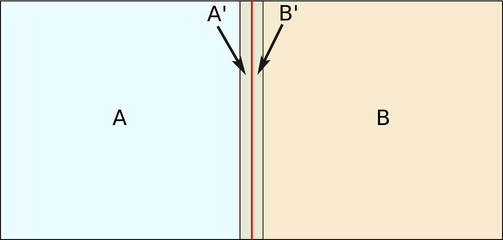
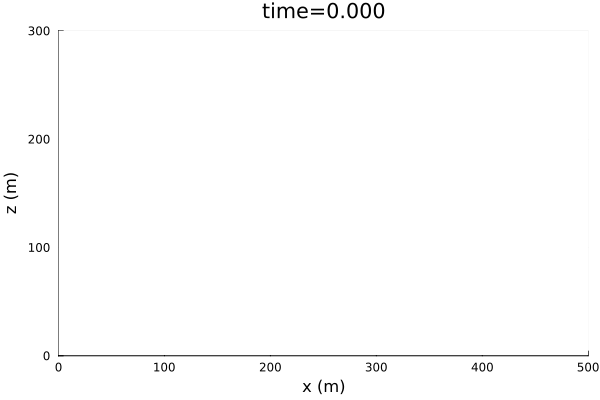
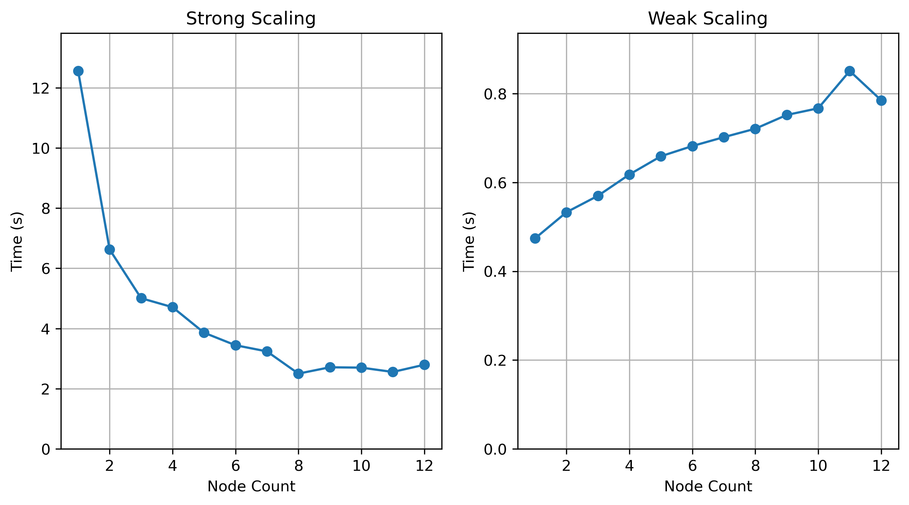
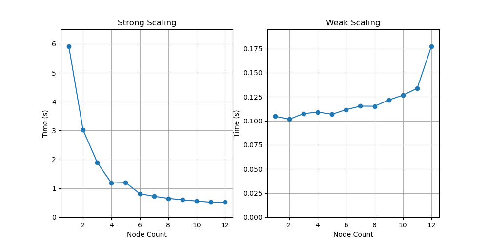

# WaveRave!

Term project for Math 540 (CSM, spring 2023)

Derrick Chambers, Peiyao Li, and Ayon Ghosh

# Question 1

> Describe the serial algorithm that you are parallelizing. What problem is it aiming to address? Describe the algorithm with specific sentences or pseudocode. How many operations does the serial algorithm for a particular problem size?

Finite difference methods are a class of numerical methods for solving partial differential equations (PDEs). They are used in a wide variety of applications, including fluid dynamics, heat transfer, and electromagnetism. In this project, we used the finite difference method for solving the acoustic wave equation, which is a PDE that describes the propagation of waves in a fluid media (although it is also often "good enough" for some elastic problems). We developed three implementations in different programming languages (C, Python, and Julia) all of which use MPI to parallelize the simulations. The following details the domain, implementation tests, and scaling tests.

The acoustic wave equation is given as:

$$
\frac{1}{c^2}\partial_t^2 p = \Delta p + s
$$

Where $p$ is the pressure, $c$ is the velocity, $\Delta$ is the Laplacian operator, and $s$ is the source. 

Applying a simple centered first order approximation, this can be written as

$$
\frac{t^{n-1}_{i,j} - 2t^n_{i,j} + t^{n+1}_{i,j}}{dt^2}  = 
c^2 (\frac{t^n_{i-1,j} -2t^n_{i,j} + t^n_{i+1,j}}{dx^2} +
 \frac{t^n_{i1,j-1} -2t^n_{i,j} + t^n_{i,j+1}}{dy^2} ) + c^2s
$$

where n, i, and j indices represent time, x, and y increments respectively.

The equation can then be rearranged to solve for the next time ($t^{n+1}_{i,j}$) based on the previous times. 

$$
t^{n+1}_{i,j}  = 
c^2 dt^2 (\frac{t^n_{i-1,j} -2t^n_{i,j} + t^n_{i+1,j}}{dx^2} +
 \frac{t^n_{i1,j-1} -2t^n_{i,j} + t^n_{i,j+1}}{dy^2} ) + c^2 dt^2 s - t^{n-1}_{i,j} + 2t^n_{i,j} 
$$

This defines the basic time stepping algorithm; for each time step the Laplacian is implemented as a convolution filter then multiplied by the ($c^2 dt^2$) and the wavefield at two previous timesteps is subtracted and two times the previous wavefield added. The source times $c^2dt^2$ is injected at specified times and locations. In practice, however, a higher order approximation is usually used for the Laplacian operator. In this project we used a 4th order central difference resulting in a stencil with the length of 9. 

The number of operations depends on the grid size, and is largely dominated by the Laplacian operator. Let $L$ be one minus the length of the centered Laplacian operator divided by two (4 in our case). Then, assuming a grid padded $l$ zeros (with dimensions $X$ by $Y$ before padding) the total number of operations related to the Laplacian is $2LXY$. This has to be calculated every time step, of a total number of timesteps $T_s$. There are also some other operations associated with adding the previous time steps and multiplying velocities, but to a first order approximation there will be $2lXYT_s$ operations. If a square Laplacian stencil is used this becomes $l^2XYT_s$. 

We selected a homogeneous 2d acoustic domain with a single explosive source occurring in the center of the domain whose source time function is a 60Hz Ricker wavelet. 

Grid cells were 5m x 5m, and a temporal sampling was selected such that the CFL criterion (Marfurt, 1984) did not exceed 0.5 for any part of the model. 

$$
V_{max} = \frac{dx}{dt}C_{max}
$$

where $V_{max}$ is the maximum velocity, $dx$ is the spatial sampling (assuming equal sample in each dimension), $dt$ is the temporal spacing, and $C_{max}$ is the maximum CFL value. 

For simplicity we simply use fixed (reflecting) boundary conditions.

# Question 2 

> Using detailed sentences or pseudocode, how are you breaking up this algorithm using a distributed memory (MPI) model? Why is this algorithm not embarrassingly parallel? Describe the initial distribution of the data/model, and what data need to be transferred between processes throughout. If it is helpful to introduce new notation, please do so, but be sure to define each index/variable specifically defined at its first use. You may include diagrams as needed. 

We are decomposing the 2D domain in strips along the long dimension of the model. For example, for a grid size of (X=300 Y=600) and using two nodes, each node would have a s subdomain of (300, 300), or, accounting for padding (300 + $l$, 300 + $l$). 
 
After each time step, $Xl$ points need to be sent to each neighbor and the same number received, with a total transfer of $4(D-1)Xl$ floating point values, where $D$ is the number of domains. For example, in the following figure Domain A needs to send the region labeled A' to B so B has the correct values in its padded region fo the next time step. Conversely, region B needs to send B' to A so region A has the correct padded values. This transfer occurs after each time step. 

This problem is not embarrassingly parallel because these exchanges must occur for each time step for the next time step's value to be calculated correctly. 

Our simulations start with a homogenous (all 0s) wavefield. A pressure source is then ejected with a Ricker wavelet with a center frequency of 60 Hz in the center of the model. 

transferred between the sub-domain borders (known as ghost regions).  

# Question 3

> Describe your test suite and use its results to make a case that your code is behaving as expected. How do you know your code is right? Are there any limitations to your test suite? 

See the following sections for information on each implementation's testing strategy.

# Question 4

> Describe the aspect of your code you chose to visualize to understand (and quickly check) whether the code is behaving as expected. What did you visualize? How did you do this? How do you know it should look like this? Include some of the figures you produced. 

See the following sections for the requested information for each implementation.

# Question 5
> Describe how you designed your strong and weak scalability tests (dimensions and number of processes). Fill out two tables with the headers (number of procs, weak test time, weak test efficiency) and (number of procs, strong test time, strong test efficiency). Comment on whether your efficiency changes, and make a case for what the biggest contributing factors may be to any slowdowns. 

## Strong Scalability
Strong scalability tests were conducted with a fixed grid size and an increasing number of nodes, from 1 to 12. The grid size selected was $800$ (y) by $480$ (x). See each implementation's section for timing results.

## Weak Scalability
Weak scalability tests were conducted using a grid size of $100N$ (x) by $60$ (y) where $N$ is the number of nodes. This way the number of cells in the domain increases linearly with the number of nodes. Each implementation section shows the details of the weak scaling test results.

# Julia

## Overview and setup

The Julia version of the code is found in the julia folder. To use it in a new account on Mio, the `setup_environment.sh` script needs to be run. This will take a few minutes as it creates a new conda environment with julia installed, then uses julia to instantiate the WaveRave package. Here are some other important files:

`WaveRave/run_jwaverave_2d.jl` - Julia script to run the simulation. Accepts a variety of command line arguments for controlling the simulation. 

`plot_wavefield.jl` - Plots the wavefield (creates a series of pngs as snapshots.)

`test.sh` - Runs the test suite. 

`weak_test.sh` - Slurm submission script to get the timing for weak scaling test. Also shows how to run jwaverave with MPI.

`strong_test.sh` - Slurm submission script to get the timing for strong scaling test

`make_scaling_stuff.py` - A simple python script to make markdown tables and plot of the strong and weak scaling. 

## Testing
There are approximately 30 tests which can be run using the `tests.sh` script. These include some simple unit tests as well as a few end2end tests. One test ensures the serial version of the code outputs the same results as the MPI version for nodes from 1 to 4, so we are confident the serial code behaves the same as the parallel code.

In order to visualize the output, we plotted the wave simulation at various snapshots:

The simulation appears healthy; there is no obvious numerical dispersion and the expected polarity reversals associated with the boundary reflection occur. Since one of the tests ensures the output wavefield of the MPI version is approximately equal to that of the serial version (plotted here) we are confident it also works for the selected models.

## Timing

The following tables and figure shows the results of the strong and weak scaling tests:

**Strong Scaling**

|   nodes |   timesteps |   grid_x |   grid_y |   time |   cells |
|--------:|------------:|---------:|---------:|-------:|--------:|
|       1 |         600 |      800 |      480 | 12.555 |  384000 |
|       2 |         600 |      800 |      480 |  6.626 |  384000 |
|       3 |         600 |      800 |      480 |  5.007 |  384000 |
|       4 |         600 |      800 |      480 |  4.708 |  384000 |
|       5 |         600 |      800 |      480 |  3.861 |  384000 |
|       6 |         600 |      800 |      480 |  3.444 |  384000 |
|       7 |         600 |      800 |      480 |  3.239 |  384000 |
|       8 |         600 |      800 |      480 |  2.501 |  384000 |
|       9 |         600 |      800 |      480 |  2.712 |  384000 |
|      10 |         600 |      800 |      480 |  2.7   |  384000 |
|      11 |         600 |      800 |      480 |  2.556 |  384000 |
|      12 |         600 |      800 |      480 |  2.796 |  384000 |

**Weak Scaling**

|   nodes |   timesteps |   grid_x |   grid_y |   time |   cells |
|--------:|------------:|---------:|---------:|-------:|--------:|
|       1 |         600 |      100 |       60 |  0.474 |    6000 |
|       2 |         600 |      200 |       60 |  0.533 |   12000 |
|       3 |         600 |      300 |       60 |  0.57  |   18000 |
|       4 |         600 |      400 |       60 |  0.618 |   24000 |
|       5 |         600 |      500 |       60 |  0.659 |   30000 |
|       6 |         600 |      600 |       60 |  0.682 |   36000 |
|       7 |         600 |      700 |       60 |  0.702 |   42000 |
|       8 |         600 |      800 |       60 |  0.721 |   48000 |
|       9 |         600 |      900 |       60 |  0.752 |   54000 |
|      10 |         600 |     1000 |       60 |  0.767 |   60000 |
|      11 |         600 |     1100 |       60 |  0.851 |   66000 |
|      12 |         600 |     1200 |       60 |  0.785 |   72000 |

A few comments:
First, the strong scaling picture is rather bleak for the tested domain size. The largest decrease in time is from 11 to 2 nodes, where the total run time is nearly cut in half. The third through 8th nodes then decrease the run time by a smaller percentage, roughly 1 second each node, until node 8, at which point the time starts to increase. 

The weak scaling behaves more stably with inefficiencies creeping up linearly until 12 nodes are added, at which point the nodes are approximately 50% as efficient as the single node case.

# Python

## Overview and setup

The Python version of the code is found in the python folder. To use it in a new account on Mio, the `set_environment.sh` script needs to be run from the python directory. This will take a few minutes as it creates a new conda environment with python installed also with mpi4py, numpy and matplotlib. Here are some other important files:

The python code runs in 3 steps:

1. Create Mesh or Velocity Model: Run with mpi src/mesher.py along with the extents as arguments

2. Create Wavefield Simulation: Run with mpi src/run.py along with the extents as arguments and the number of simulations(not time_step) also

3. Plot Wavefield: Plot wavefield using src/plot.py with the extents and number of precessors used as arguments

All other parameter needed for simulations are being read from the src/params.py file. To switch off checkpointing, change the variable checkpointing to 0.

`test_unit.sh` - Runs Unit tests

`test.sh` - Runs the integrated test suite. 

`weak_test.sh` - Slurm submission script to get the timing for weak scaling test.

`strong_test.sh` - Slurm submission script to get the timing for strong scaling test

`plot_scaling.py` - A simple python to plot the strong and weak scaling.

## Testing

A few unit tests are provided along with a integration test. For the integration test, the simulations for same parameter are run with 1 and 8 processes and their difference is calculated at the end. The maximum of the difference is returned which shows 0, which confirms that they are running well. To compare the time simulations, here are two simulations showing the wavefield evolution with time,

They are quite similar, which suggests they are working well. The animations were made using ImageMagick convert, not provided in test. Instead, simulation plots at each time step is there.

## Timing

The following tables and figure shows the results of the strong and weak scaling tests:

**Strong Scaling**

|   cores |   timesteps |   grid_x |   grid_y |   time |   cells |
|--------:|------------:|---------:|---------:|-------:|--------:|
|       1 |        1000 |      800 |      480 |  5.913 |  384000 |
|       2 |        1000 |      800 |      480 |  3.023 |  384000 |
|       3 |        1000 |      800 |      480 |  1.895 |  384000 |
|       4 |        1000 |      800 |      480 |  1.183 |  384000 |
|       5 |        1000 |      800 |      480 |  1.197 |  384000 |
|       6 |        1000 |      800 |      480 |  0.812 |  384000 |
|       7 |        1000 |      800 |      480 |  0.721 |  384000 |
|       8 |        1000 |      800 |      480 |  0.650 |  384000 |
|       9 |        1000 |      800 |      480 |  0.602 |  384000 |
|      10 |        1000 |      800 |      480 |  0.559 |  384000 |
|      11 |        1000 |      800 |      480 |  0.518 |  384000 |
|      12 |        1000 |      800 |      480 |  0.515 |  384000 |

**Weak Scaling**

|   nodes |   timesteps |   grid_x |   grid_y |   time  |   cells |
|--------:|------------:|---------:|---------:|--------:|--------:|
|       1 |         600 |      100 |       60 |  0.1047 |    6000 |
|       2 |         600 |      200 |       60 |  0.1017 |   12000 |
|       3 |         600 |      300 |       60 |  0.1074 |   18000 |
|       4 |         600 |      400 |       60 |  0.1092 |   24000 |
|       5 |         600 |      500 |       60 |  0.1069 |   30000 |
|       6 |         600 |      600 |       60 |  0.1116 |   36000 |
|       7 |         600 |      700 |       60 |  0.1153 |   42000 |
|       8 |         600 |      800 |       60 |  0.1151 |   48000 |
|       9 |         600 |      900 |       60 |  0.1216 |   54000 |
|      10 |         600 |     1000 |       60 |  0.1266 |   60000 |
|      11 |         600 |     1100 |       60 |  0.1337 |   66000 |
|      12 |         600 |     1200 |       60 |  0.1773 |   72000 |

# C

# Code Comparisons

# References
See the [references file](references.md).
