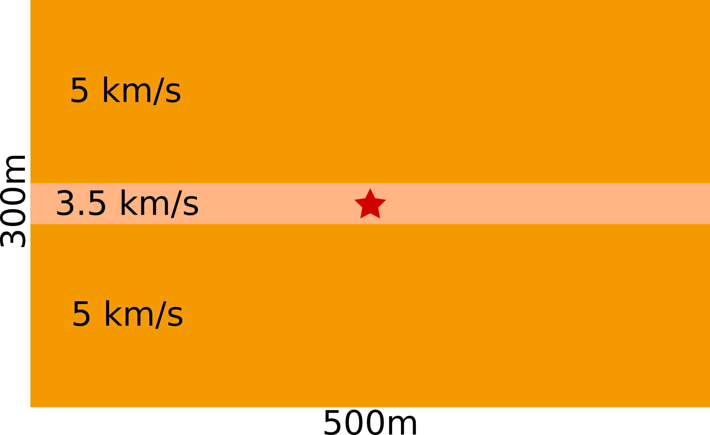

# WaveRave!

Term project for Math 540 (CSM, spring 2023)

Derrick Chambers, Peiyao Li, and Ayon Ghosh

# Introduction

Finite difference methods are a class of numerical methods for solving partial differential equations (PDEs). They are used in a wide variety of applications, including fluid dynamics, heat transfer, and electromagnetism. In this project, we used the finite difference method for solving the wave equation, which is a PDE that describes the propagation of waves. We developed three implementations in different programming languages (C, python, and Julia) all of which used MPI to parallelize the simulations. The following details the domain, implementation tests, and scaling tests.

The acoustic wave equation is given as:

$$
\partial_t^2 p = c^2 \Delta p + s
$$

Where $p$ is the pressure, $c$ is the velocity, $\Delta$ is the Laplacian operator, and $s$ is the source. 

# Simulation Parameters

We selected a simple 2d domain acoustic consisting of two high velocity zones, each 135m thick, surrounding one low velocity zone, 30m thick, and a single explosive source occurring in the center of the domain whose source time function is a 20Hz Ricker wavelet. 

Grid cells were 1m x 1m, and a temporal sampling was selected such that the CFL criterion (Marfurt, 1984) did not exceed 0.5 for any part of the model. 

$$
V_{max} = \frac{dx}{dt}C_{max}
$$

$$
dt = \frac{dx}{V_{max}}C_{max} = \frac{1}{5000}0.5 = \frac{1}{10000} 
$$

Where $V_{max}$ is the maximum model velocity, $dt$ and $dx$ are the time step and grid discretization, and $C_{max}$ is the maximum CFL criterion.

For simplicity we simply use fixed (reflecting) boundary conditions.

